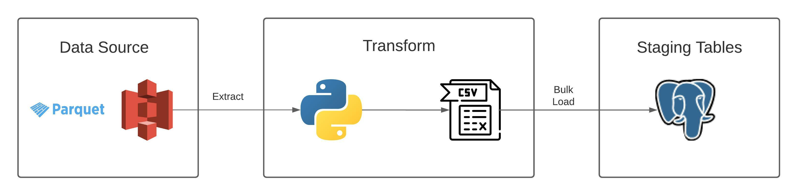

#### Overview (Work in Progress)
Project **s3_fetch** is an exercise on performing ETL on data sets on Amazon S3 into a PostgreSQL database. The datasets on S3 are from the Amazon AWS Public Data Sets and for this implementation the dataset is from Ookla on https://registry.opendata.aws/speedtest-global-performance/.

The datasets on S3 are in parquet format which necessitated using Pandas to read the parquet files into a data frame then exported into CSV to be bulk-loaded into PostgreSQL with psycopg2.

**etl.py** was limited to fetch only 1 parquet file due to bandwidth constraints.

#### Tags
Python 3, PostgreSQL, AWS S3, ETL

#### Process Diagram

#### To-Do
1. Add value by doing transformation of staging data
2. Load to DWH dimensional tables
3. Check for potential insights to gain from data