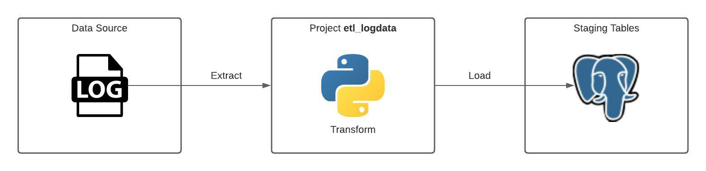

#### Overview (Work In Progress)
Project **etl_logdata** is practice code for ETL-ing log data into PostgreSQL staging tables.

A log file includes rows in this structure:
```
[2021-04-23 10:56:27] local.INFO: ProductController: UPDATED Product FROM {"productid":1035,"unitId":1,"productName":"PP-R Female With thread Coupling 1\/2x3\/4","productSize":"0","productSellingPrice":"0.00","productBuyingPrice":"0.00","productQuantity":0,"created_at":"2020-12-02 14:14:33","updated_at":"2021-03-30 11:07:04","productDiscount1":0,"productDiscount2":0,"productInIB":1} TO {"productid":1035,"unitId":1,"productName":"PP-R Female With thread Coupling 1\/2x3\/4","productSize":0,"productSellingPrice":"154.80","productBuyingPrice":"0.00","productQuantity":0,"created_at":"2020-12-02 14:14:33","updated_at":"2021-04-23 10:56:27","productDiscount1":"15","productDiscount2":0,"productInIB":1}  
```

**etl.py** decomposes a log row into 5 columns: ***ts***, ***app_module***, ***action***, ***username***, and ***log_entry***.

#### Tags
Python 3, PostgreSQL, ETL

#### Process Diagram


#### To-Do
1. Add value by doing transformation of staging data
2. Load to DWH dimensional tables
3. Check for analytics insights
4. Transform to Parquet/CSV for a data lake approach
